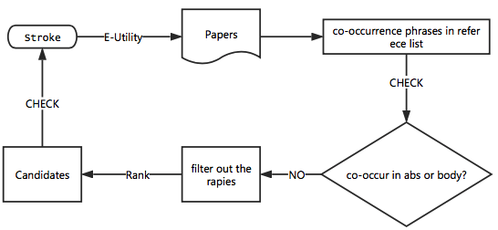
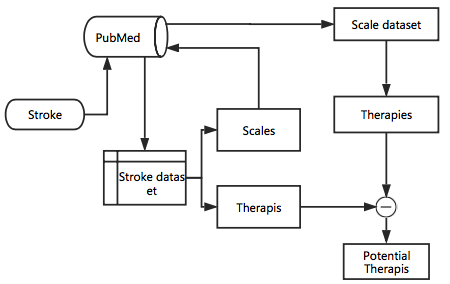

# Therapies_finding
Given one or more disease, find some potential therapies.

    1. co-citation based 
    2. network based

### 1. Co-citation based
Based on co-citation relations, we found some latent knowledge, and use latent knowledge to find potential therapies for a given disease.

 
### 2. Diseases-Scales-Therapies Network
The code are mainly included in directory DSTN.
main procedure is as follows:

